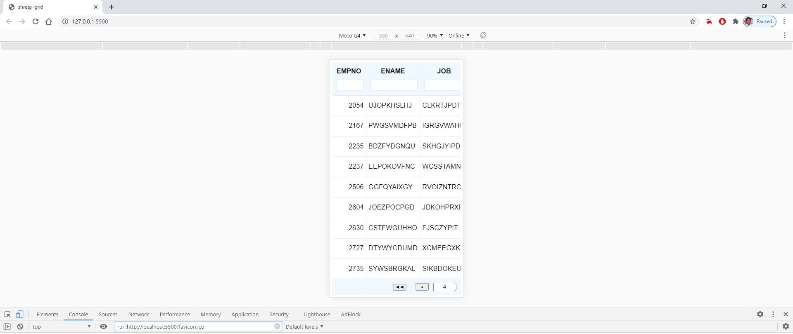

# shreeji-grid

Grid application that displays data from database in grid

Technologies used:
- *Front-end*: Vanilla JS, SCSS, HTML5 (No front-end library or framework)
- *Back-end*: Spring boot with Oracle 11g database

Screenshots: 
- Table

- Sorting ASC

- Sorting DESC

- Filter

- Page size change

- Server-side pagination

- In small screen devices

